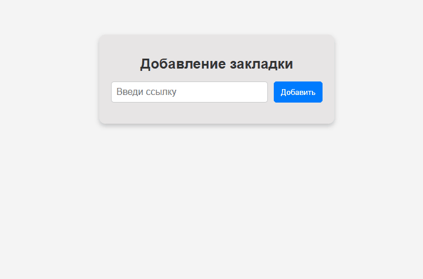

Простое React-приложение для сохранения закладок на веб-страницы.

##  Функционал
-  Валидация URL через `yup`
-  Получение заголовка страницы через прокси
-  Мультиязычность с `i18next`
-  Адаптивный дизайн
-  ESLint с конфигурацией `airbnb`
-  Автоматическая проверка кода через GitHub Actions

##  Демо

##  Установка и запуск

1. **Клонируйте репозиторий**  

    git clone https://github.com/Vlad6376/bookmark.git
    cd bookmark

2.  **Установите зависимости**

    npm install

3.  **Запустите в режиме разработки**

    npm start

4.  **Соберите проект для продакшена**

    npm run build

5.  **Запустите линтер**

    npm run lint

##    Используемые технологии

-   React + TypeScript
-   Yup (валидация URL)
-   i18next (локализация)
-   ESLint (Airbnb)
-   Webpack
-   GitHub Actions (автоматический запуск линтера)